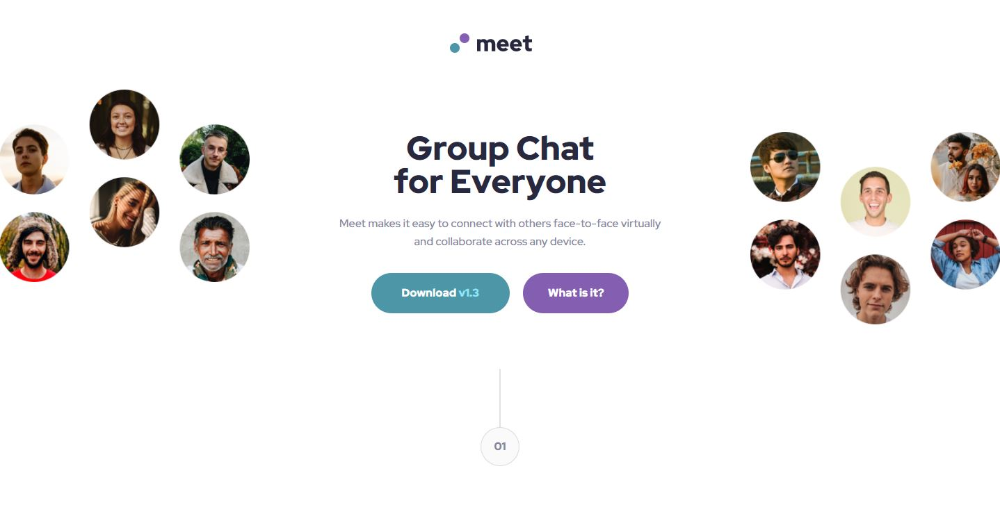
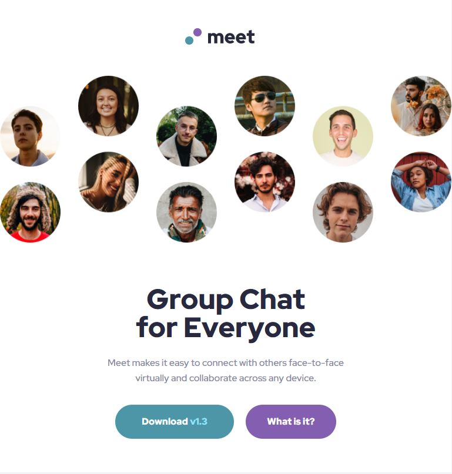
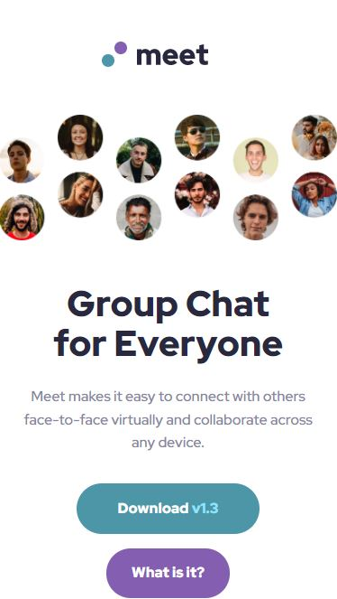

## Table of contents

- [Overview](#overview)
  - [The challenge](#the-challenge)
  - [Screenshot](#screenshot)
  - [Links](#links)
- [My process](#my-process)
  - [Built with](#built-with)
  - [Useful resources](#useful-resources)
- [Author](#author)

## Overview

I took on the challenge the build the meet landing page for mobile, tablet and desktop. In building this project I decided to bulid the website mobile-first rather then desktop-first.

### The challenge

Users should be able to:

- View the optimal layout depending on their device's screen size
- See hover states for interactive elements

### Screenshot

### Links

- Solution URL: [Add solution URL here](https://your-solution-url.com)

## My process

1. Review project brief
2. Have a look at design files
3. Plan how I will action the coding challenege
4. Set up the project files
5. Set up basic styles and HTML Markup
6. Styling with Sass
7. Made website responsive

### Built with

- Semantic HTML5 markup
- CSS custom properties
- Sass
- Flexbox
- Mobile-first workflow
- BEM (Block Elements Modifier)

### Useful resources

- [Bennett Feely](https://bennettfeely.com/clippy/) - I found this website very useful as it help me to create the rounder corners around the images.

- [w3schools (PX - EM)](https://www.w3schools.com/tags/ref_pxtoemconversion.asp*/) - This site was really helpful when converting PX's to EM's units.

## Author

- Github - [JulianJ44](https://github.com/JulianJ44)
- Frontend Mentor - [@JulianJ44](https://www.frontendmentor.io/profile/JulianJ44/)
